
# COSC 516 - Cloud Databases Lab 5 - Microsoft Azure Cosmos DB

## Setup
Create a Azure free tier account at: [https://azure.microsoft.com/en-us/free/](https://azure.microsoft.com/en-us/free/).

The free tier account allows for free trials forever and 12-months free offers from your sign up period. You will need an email address to use. The sign-up also asks for a credit card. If you do not have a credit card, then a pre-paid credit card with a small amount should work.

## Azure Portal
Login to Azure. In the Azure Portal, click on `More services` then select `Databases` category. Select `Azure Cosmos DB` and click `Create`.
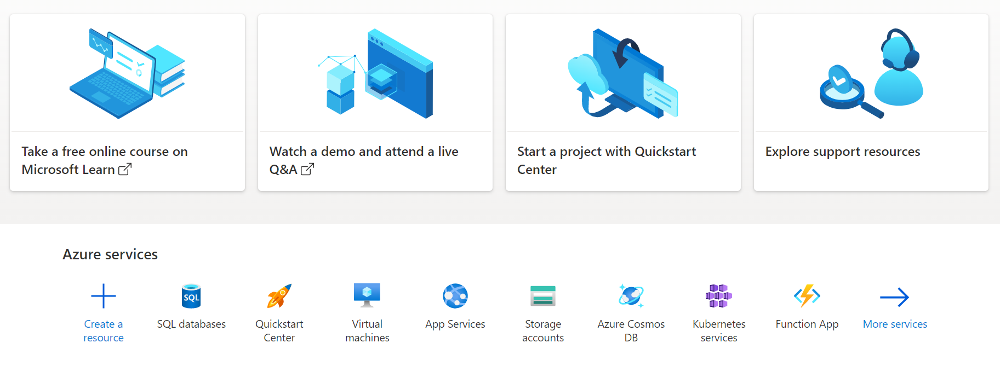
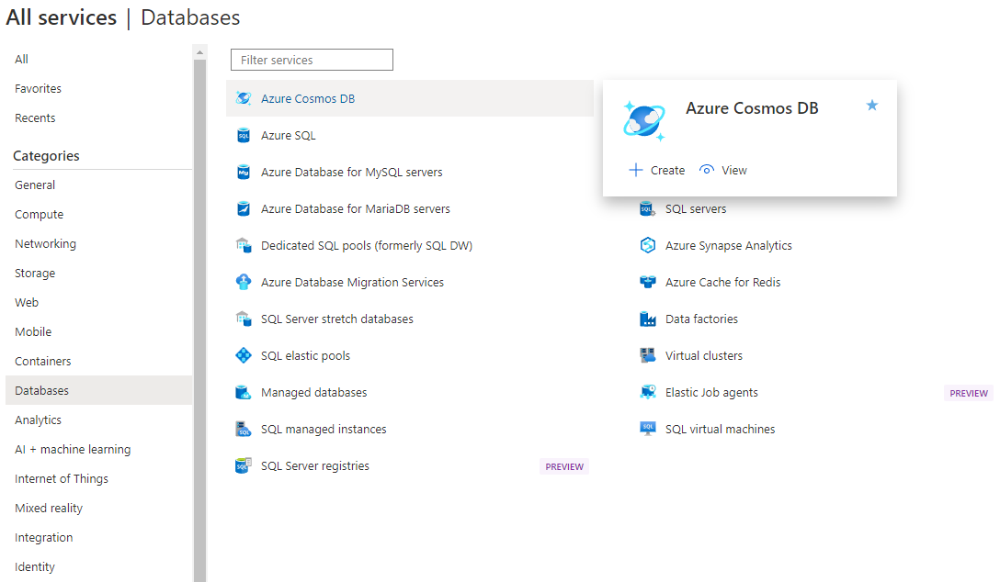

## Create Azure Cosmos DB Account
Select first option with `Azure Cosmos DB NoSQL` and click `Create`. 
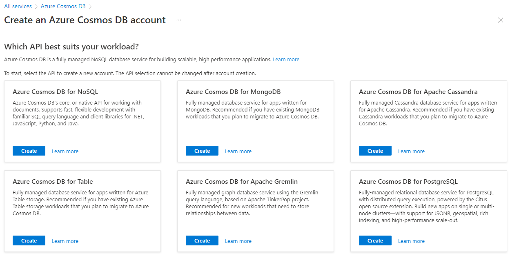

For `Resource group`, use existing or click `Create new` and use name `rg516`.
 
For `Account name` use something like `cosc516`. This name will be used as part of the DNS address for requests - so it must be unique.
 
For `Location` select `(US) West US`.
 
For `Capacity mode` select `Provisioned throughput`.
 
For `Apply Free Tier Discount` select `Apply`.
 
Check `Limit total account throughput` to avoid unexpected charges.
 
Click `Review + create` or explore remaining configurations and then create.
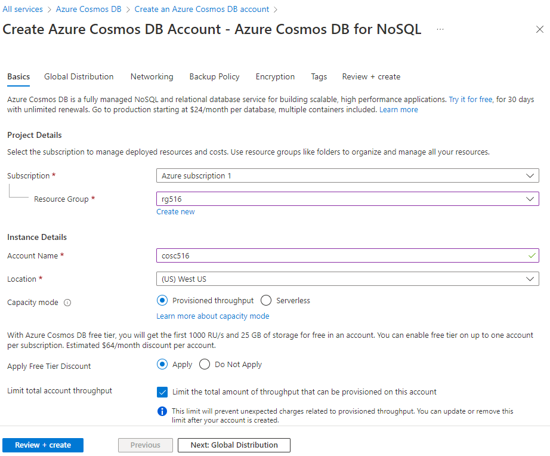

After deployment is complete, click `Go to resource`.
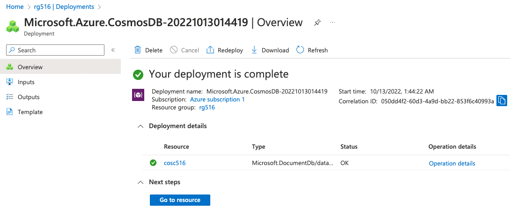

## Configure Azure Cosmos DB Account
### Replicate data globally
Under settings in the left side menu, click `Replicate data globally`.
 
Set Configure regions Multi-region writes to `Enabled`
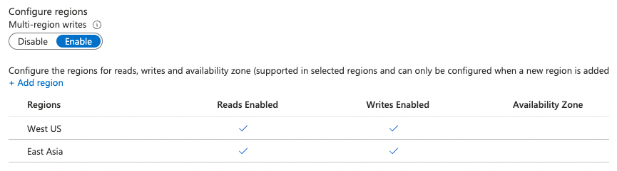

Select another region to add to the Cosmos DB account.
 
Click `Save`.
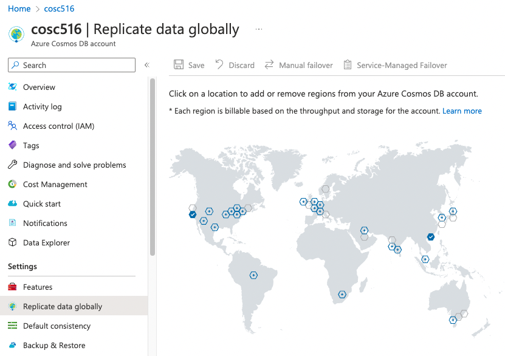
 

### Default consistency
Under settings in the left side menu, click `Default consistency`.
 
Select the `Bounded Staleness` consistency level.

 
Set `Maximum Lag (Time)` to `1 day`.
 
Set `Maximum Lag (Operations)` to `100000`.
 
Click `Save`.
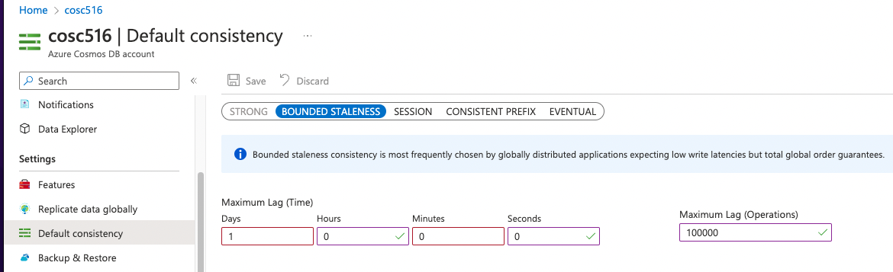
 

## Create the Database
From the Cosmos DB account home page, click `Data Explorer` in the left side menu.
 
Click the down arrow beside `New Container` and select `New Database`
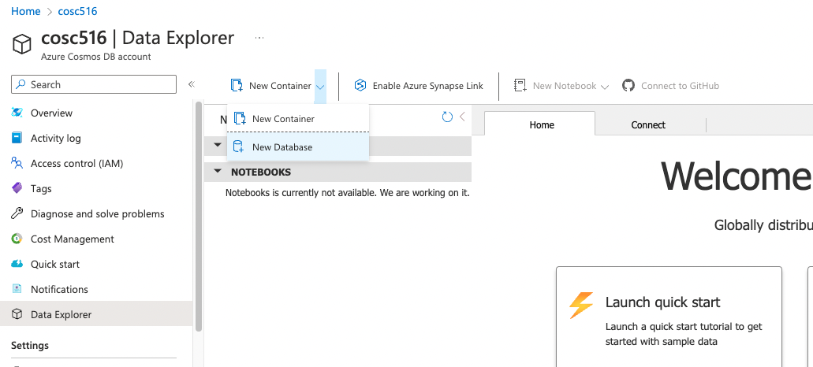
 

Use `cosmos516` for the Database id.
 
Leave `Provision throughput` selected.
 
For throughput, select `Manual` and provision the database with `500 RU/s`.
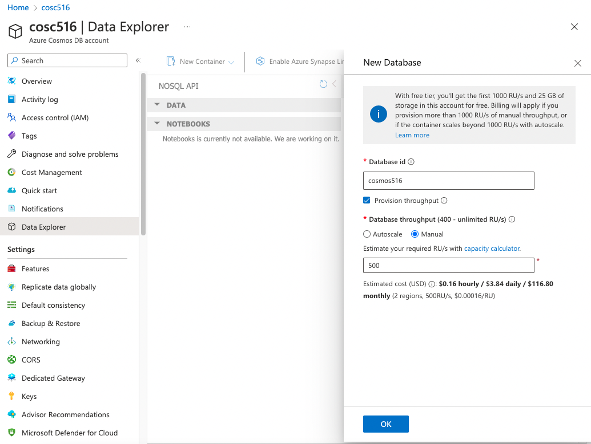
 

## Create the Customer Container
First, set Database Max RU/s to 0 and ensure the `OK` button is activated.
 
For Database id, select `Use existing` and use `cosmos516`
 
For Container id, use `customer`.
 
For Partition key, use `/c_custkey`.
 
Click `OK`
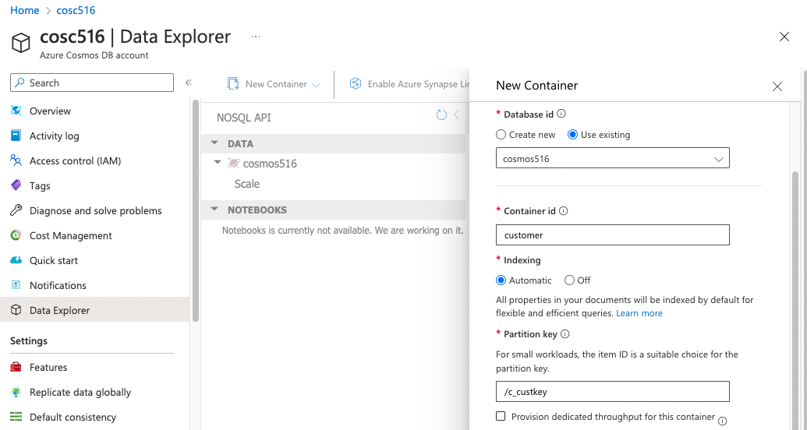

## Create the Orders Container
First, set Database Max RU/s to 0 and ensure the `OK` button is activated.
 
For Database id, select `Use existing` and use `cosmos516`
 
For Container id, use `orders`.
 
For Partition key, use `/o_custkey`.
 
Click `OK`
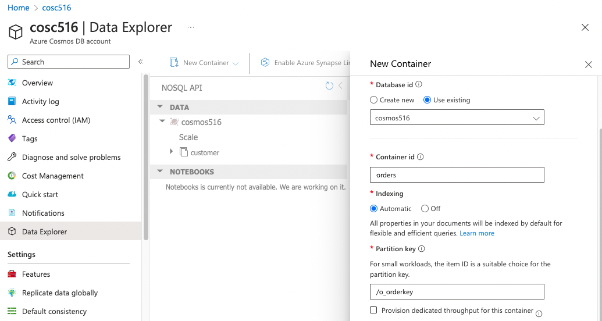

## Tasks
To test your database, write Java code using VS Code. The file to edit is `CosmosDB.java`.  The test file is `TestCosmosDB.java`.  Fill in the methods requested (search for **TODO**).  Marks for each method are below.  You receive the marks if you pass the JUnit tests AND have followed the requirements asked in the question (including documentation and proper formatting).

- +1 mark - Write the method `connect()` to make a connection to the database.
- +2 marks - Write `drop()` to drop the containers from the database. 
- +4 marks - Write `load()` to recreate containers and load the data into the database.
- +2 marks - Write `query1()` to get customer by custkey.
- +3 marks - Write `query2()` to get number of customers in each market segment.
- +4 marks - Write `query3()` to get all urgent orders placed on or before July, 26, 1998 ordered by total price descending.
- +5 marks - Write `query4()` to get a customer and all orders by custkey.

**Total Marks: 20**

## Bonus Marks: (up to 2)
Up to +2 bonus marks for demonstrating some other feature of Cosmos DB.

## Submission
The lab can be marked immediately by the professor or TA by showing the output of the JUnit tests and by a quick code review.  Otherwise, submit the URL of your GitHub repository on Canvas. **Make sure to commit and push your updates to GitHub.**